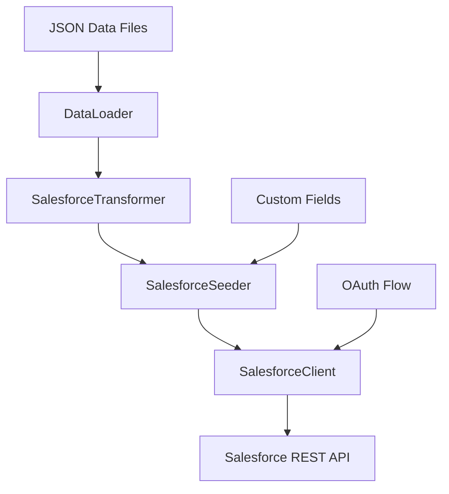

# Salesforce Integration - Implementation Plan

## Overview

This document outlines the complete implementation plan for adding Salesforce CRM support to the Classic Models Seeder CLI. The implementation follows the same architectural patterns established for HubSpot integration.

## Project Goals

1. Enable seeding of Salesforce Developer Edition with Classic Models demo data
2. Support idempotent operations (upsert based on External IDs)
3. Maintain consistency with HubSpot implementation patterns
4. Provide comprehensive error handling and logging
5. Include full test coverage and documentation

## Architecture Overview

### Component Structure

```
cmcli/
├── salesforce/
│   ├── __init__.py
│   ├── client.py          # Salesforce REST API client
│   ├── auth.py            # OAuth 2.0 authentication
│   ├── fields.py          # Custom field definitions
│   ├── transformers.py    # Data transformation layer
│   └── seeder.py          # Seeding orchestration
├── commands/
│   └── salesforce.py      # CLI commands
└── config.py              # Add Salesforce config
```

### Data Flow



## Phase 1: Specifications & Design

### 1.1 Salesforce API Research ✅

**Status**: Completed in `specs/setup/SALESFORCE.md`

Key findings:
- Use REST API v59.0 or later
- OAuth 2.0 Username-Password flow for automation
- External ID fields for idempotent upserts
- Composite API for batch operations
- Rate limit: 5,000 API calls per 24 hours (Developer Edition)

### 1.2 Data Mappings ✅

**Status**: Completed in `specs/setup/SALESFORCE.md`

Mappings defined:
- **Accounts** ← Customers (122 records)
- **Contacts** ← Employees (23 records)
- **Opportunities** ← Orders (326 records)

### 1.3 Custom Fields Design ✅

**Status**: Completed in `specs/setup/SALESFORCE.md`

Custom fields for:
- Account: `ERP_Customer_Number__c`, `Credit_Limit__c`, `Sales_Rep_Employee_Number__c`
- Contact: `ERP_Employee_Number__c`, `Office_Code__c`, `Reports_To_Employee_Number__c`
- Opportunity: `ERP_Order_Number__c`, `Order_Date__c`, `Required_Date__c`, `Shipped_Date__c`, `Order_Status__c`, `Payment_Status__c`, `Order_Comments__c`

## Phase 2: Core Implementation

### 2.1 Authentication Module (`cmcli/salesforce/auth.py`) ✅

**Status**: Completed with SOAP API authentication

**Purpose**: Handle Salesforce authentication using SOAP API

**Key Components**:
```python
class SalesforceAuth:
    """Handle Salesforce SOAP API authentication via simple-salesforce."""
    
    def __init__(self, config: SalesforceConfig):
        """Initialize with credentials."""
        
    def get_access_token(self) -> str:
        """Get session ID (acts as access token)."""
        
    def get_instance_url(self) -> str:
        """Get Salesforce instance URL."""
        
    def validate_token(self) -> bool:
        """Validate current session."""
```

**Authentication Flow**:
1. SOAP API Login (via simple-salesforce)
   - Uses username, password, and security token
   - Returns session ID and instance URL
   - No OAuth complexity required

2. Session Management:
   - Session ID stored in memory
   - Sessions last ~2 hours
   - Simple re-authentication on expiration

**Key Learnings from Implementation**:
- ⚠️ OAuth Username-Password flow is disabled in newer Salesforce orgs
- ⚠️ SOAP API is disabled by default - must be enabled in Setup → User Interface
- ✅ SOAP authentication is simpler and more reliable for automation
- ✅ No Connected App or OAuth credentials needed
- ✅ IP restrictions should be disabled for smooth authentication

**Dependencies**:
- `simple-salesforce>=1.12.0` for SOAP authentication
- `requests` for HTTP calls
- `pydantic` for config validation

**Actual Effort**: 8 hours (including troubleshooting OAuth issues)

### 2.2 API Client (`cmcli/salesforce/client.py`)

**Purpose**: Salesforce REST API client with rate limiting

**Key Components**:
```python
class SalesforceClient:
    """Salesforce REST API client with rate limiting and retry logic."""
    
    def __init__(self, config: SalesforceConfig):
        """Initialize with OAuth config and auth handler."""
        
    def _make_request(self, method: str, endpoint: str, **kwargs) -> Dict:
        """Make authenticated API request with rate limiting."""
        
    def query(self, soql: str) -> List[Dict]:
        """Execute SOQL query."""
        
    def create_record(self, sobject: str, data: Dict) -> str:
        """Create a record and return ID."""
        
    def update_record(self, sobject: str, record_id: str, data: Dict) -> None:
        """Update an existing record."""
        
    def upsert_record(self, sobject: str, external_id_field: str, 
                     external_id: str, data: Dict) -> Dict:
        """Upsert record using external ID."""
        
    def create_custom_field(self, sobject: str, field_def: Dict) -> None:
        """Create a custom field using Metadata API."""
        
    def get_custom_fields(self, sobject: str) -> List[Dict]:
        """Get existing custom fields for an object."""
        
    def composite_request(self, requests: List[Dict]) -> List[Dict]:
        """Execute multiple requests in a single API call."""
```

**Rate Limiting Strategy**:
- Track API calls per 24-hour window
- Implement exponential backoff for 429 responses
- Use Composite API to reduce call count
- Batch operations where possible

**Error Handling**:
- Retry on network errors (3 attempts)
- Handle 401 (refresh token)
- Handle 429 (rate limit)
- Handle 400/404 (validation errors)

**Estimated Effort**: 8 hours

### 2.3 Custom Fields Module (`cmcli/salesforce/fields.py`)

**Purpose**: Define custom field metadata

**Key Components**:
```python
ACCOUNT_CUSTOM_FIELDS = [
    {
        "fullName": "Account.ERP_Customer_Number__c",
        "label": "ERP Customer Number",
        "type": "Text",
        "length": 50,
        "externalId": True,
        "unique": True,
        "required": False
    },
    # ... more fields
]

CONTACT_CUSTOM_FIELDS = [...]
OPPORTUNITY_CUSTOM_FIELDS = [...]

def get_fields_for_object(sobject: str) -> List[Dict]:
    """Get custom field definitions for an object."""
    
def get_all_custom_fields() -> Dict[str, List[Dict]]:
    """Get all custom field definitions."""
```

**Field Types**:
- Text (External ID, Unique)
- Currency
- Date
- Picklist
- Long Text Area

**Estimated Effort**: 3 hours

### 2.4 Data Transformers (`cmcli/salesforce/transformers.py`)

**Purpose**: Transform Classic Models data to Salesforce format

**Key Components**:
```python
class SalesforceTransformer:
    """Transform Classic Models data to Salesforce format."""
    
    def transform_customer_to_account(self, customer: Dict) -> Dict:
        """Transform customer to Salesforce Account."""
        
    def transform_employee_to_contact(self, employee: Dict, 
                                     account_id: Optional[str] = None) -> Dict:
        """Transform employee to Salesforce Contact."""
        
    def transform_order_to_opportunity(self, order: Dict, 
                                      order_details: List[Dict],
                                      payments: List[Dict],
                                      account_id: str) -> Dict:
        """Transform order to Salesforce Opportunity."""
        
    def map_order_status_to_stage(self, status: str) -> Tuple[str, int]:
        """Map order status to Opportunity stage and probability."""
        
    def derive_payment_status(self, order: Dict, payments: List[Dict]) -> str:
        """Derive payment status from order and payment data."""

# Batch transformation functions
def batch_transform_customers_to_accounts(customers: List[Dict]) -> List[Dict]:
    """Batch transform customers to accounts."""
    
def batch_transform_employees_to_contacts(employees: List[Dict]) -> List[Dict]:
    """Batch transform employees to contacts."""
    
def batch_transform_orders_to_opportunities(orders: List[Dict], 
                                           order_details: List[Dict],
                                           payments: List[Dict]) -> List[Dict]:
    """Batch transform orders to opportunities."""
```

**Transformation Logic**:
- Generate website from company name
- Map order status to opportunity stage
- Calculate opportunity amount from order details
- Derive payment status from payments
- Handle null/missing values gracefully

**Estimated Effort**: 6 hours

### 2.5 Seeder Orchestration (`cmcli/salesforce/seeder.py`)

**Purpose**: Orchestrate the seeding process

**Key Components**:
```python
class SalesforceSeeder:
    """Orchestrate seeding of Salesforce with Classic Models data."""
    
    def __init__(self, client: SalesforceClient, data_loader: DataLoader):
        """Initialize with client and data loader."""
        
    def ensure_custom_fields_exist(self, sobjects: List[str]) -> None:
        """Ensure custom fields exist on specified objects."""
        
    def seed_accounts(self, customers: Optional[List[Dict]] = None) -> int:
        """Seed accounts from customers."""
        
    def seed_contacts(self, employees: Optional[List[Dict]] = None) -> int:
        """Seed contacts from employees."""
        
    def seed_opportunities(self, orders: Optional[List[Dict]] = None) -> int:
        """Seed opportunities from orders."""
        
    def seed_all(self) -> Dict[str, int]:
        """Seed all objects in correct order."""
        
    def _find_account_by_erp_id(self, erp_customer_number: str) -> Optional[str]:
        """Find account ID by ERP customer number."""
        
    def _find_contact_by_erp_id(self, erp_employee_number: str) -> Optional[str]:
        """Find contact ID by ERP employee number."""
        
    def _find_opportunity_by_erp_id(self, erp_order_number: str) -> Optional[str]:
        """Find opportunity ID by ERP order number."""
```

**Seeding Strategy**:
1. **Accounts First**: Create/update all accounts
2. **Contacts Second**: Create/update contacts with account links
3. **Opportunities Last**: Create/update opportunities with account/contact links

**Idempotency**:
- Use External ID upserts (`PATCH /sobjects/{object}/{external_id_field}/{external_id}`)
- Query existing records before creating
- Update existing records instead of creating duplicates

**Progress Tracking**:
- Use Rich library for progress bars
- Show current/total counts
- Display record names being processed

**Estimated Effort**: 8 hours

### 2.6 Configuration (`cmcli/config.py`) ✅

**Status**: Completed with simplified SOAP configuration

**Purpose**: Add Salesforce configuration

**Key Components**:
```python
class SalesforceConfig(BaseModel):
    """Salesforce API configuration."""
    
    username: str = Field(..., description="Salesforce username")
    password: str = Field(..., description="Salesforce password")
    security_token: str = Field(..., description="Salesforce security token")
    instance_url: str = Field(..., description="Salesforce instance URL")
    api_version: str = Field(default="v59.0", description="API version")
    
    @classmethod
    def from_env(cls) -> "SalesforceConfig":
        """Load configuration from environment variables."""
        return cls(
            username=os.getenv("SALESFORCE_USERNAME"),
            password=os.getenv("SALESFORCE_PASSWORD"),
            security_token=os.getenv("SALESFORCE_SECURITY_TOKEN"),
            instance_url=os.getenv("SALESFORCE_INSTANCE_URL"),
            api_version=os.getenv("SALESFORCE_API_VERSION", "v59.0")
        )
```

**Key Changes**:
- ❌ Removed `client_id` and `client_secret` (not needed for SOAP)
- ✅ Simplified to 5 required fields
- ✅ All fields loaded from environment variables

**Actual Effort**: 1 hour

### 2.7 CLI Commands (`cmcli/commands/salesforce.py`)

**Purpose**: Implement CLI commands

**Commands**:
```python
@click.group()
def salesforce():
    """Salesforce CRM commands."""
    pass

@salesforce.command()
@click.pass_context
def verify(ctx):
    """Verify Salesforce credentials and permissions."""
    # Check authentication
    # Verify object access (Account, Contact, Opportunity)
    # Check custom field permissions
    # Display results with Rich tables

@salesforce.command()
@click.pass_context
def setup_fields(ctx):
    """Create custom fields on Salesforce objects."""
    # Create Account custom fields
    # Create Contact custom fields
    # Create Opportunity custom fields
    # Display progress and results

@salesforce.command()
@click.option('--accounts-only', is_flag=True)
@click.option('--contacts-only', is_flag=True)
@click.option('--opportunities-only', is_flag=True)
@click.pass_context
def seed(ctx, accounts_only, contacts_only, opportunities_only):
    """Seed Salesforce with Classic Models data."""
    # Load data
    # Seed based on flags
    # Display progress and results

@salesforce.command()
@click.confirmation_option(prompt='Are you sure you want to delete all seeded data?')
@click.pass_context
def purge(ctx):
    """Delete all seeded data from Salesforce."""
    # Query and delete opportunities
    # Query and delete contacts
    # Query and delete accounts
    # Display results
```

**Estimated Effort**: 6 hours

## Phase 3: Testing

### 3.1 Unit Tests

**Test Files**:
- `tests/test_salesforce_auth.py` - OAuth authentication
- `tests/test_salesforce_client.py` - API client methods
- `tests/test_salesforce_transformers.py` - Data transformations
- `tests/test_salesforce_seeder.py` - Seeding logic

**Test Coverage Goals**:
- Authentication: Token acquisition, refresh, validation
- Client: CRUD operations, upserts, queries, error handling
- Transformers: All data mappings, edge cases, null handling
- Seeder: Seeding order, idempotency, progress tracking

**Mocking Strategy**:
- Mock Salesforce API responses
- Mock OAuth token responses
- Use fixtures for test data

**Estimated Effort**: 12 hours

### 3.2 Integration Tests

**Test Scenarios**:
1. Full seeding workflow (accounts → contacts → opportunities)
2. Partial seeding (individual flags)
3. Re-seeding (idempotency verification)
4. Custom field creation
5. Error recovery (network failures, rate limits)

**Requirements**:
- Salesforce Developer Edition sandbox
- Test data cleanup after each run
- Automated CI/CD integration

**Estimated Effort**: 8 hours

### 3.3 Manual Testing Checklist

- [ ] Create Salesforce Developer Edition account
- [ ] Configure Connected App
- [ ] Run `cmcli salesforce verify`
- [ ] Run `cmcli salesforce setup-fields`
- [ ] Run `cmcli salesforce seed`
- [ ] Verify data in Salesforce UI
- [ ] Test partial seeding flags
- [ ] Test re-seeding (idempotency)
- [ ] Test error scenarios
- [ ] Test `cmcli salesforce purge`

**Estimated Effort**: 4 hours

## Phase 4: Documentation

### 4.1 User Documentation

**Files to Create/Update**:
- ✅ `specs/setup/SALESFORCE.md` - Setup guide (completed)
- `README.md` - Add Salesforce to supported apps
- `docs/salesforce-guide.md` - Detailed usage guide
- `docs/api-reference.md` - Update with Salesforce commands

**Content**:
- Account setup instructions
- Connected App configuration
- CLI command reference
- Data mapping details
- Troubleshooting guide

**Estimated Effort**: 6 hours

### 4.2 Developer Documentation

**Files to Create**:
- `docs/salesforce-architecture.md` - Technical architecture
- `docs/salesforce-api-notes.md` - API quirks and best practices
- Inline code documentation (docstrings)

**Content**:
- Component architecture
- Authentication flow diagrams
- Data transformation logic
- Error handling strategies
- Rate limiting approach

**Estimated Effort**: 4 hours

## Phase 5: Deployment & Maintenance

### 5.1 Code Review

**Review Checklist**:
- [ ] Code follows project patterns (HubSpot consistency)
- [ ] All tests passing
- [ ] Documentation complete
- [ ] Error handling comprehensive
- [ ] Logging appropriate
- [ ] Type hints present
- [ ] No hardcoded values

**Estimated Effort**: 4 hours

### 5.2 CI/CD Integration

**Tasks**:
- Add Salesforce tests to GitHub Actions
- Configure test Salesforce org credentials
- Add Salesforce to test matrix
- Update coverage requirements

**Estimated Effort**: 3 hours

### 5.3 Release

**Tasks**:
- Update `specs/PROJECT.md` with Salesforce
- Update main `README.md`
- Create release notes
- Tag version (e.g., v0.2.0)
- Update documentation site

**Estimated Effort**: 2 hours

## Timeline & Effort Summary

| Phase | Tasks | Estimated Hours | Priority |
|-------|-------|----------------|----------|
| **Phase 1: Specs** | Research, mappings, design | 4 | High |
| **Phase 2: Implementation** | Core modules | 37 | High |
| **Phase 3: Testing** | Unit, integration, manual | 24 | High |
| **Phase 4: Documentation** | User & developer docs | 10 | Medium |
| **Phase 5: Deployment** | Review, CI/CD, release | 9 | Medium |
| **Total** | | **84 hours** | |

**Estimated Timeline**: 2-3 weeks (assuming 1 developer, 40 hours/week)

## Dependencies

### Python Packages
- `requests` - HTTP client (already installed)
- `pydantic` - Config validation (already installed)
- `click` - CLI framework (already installed)
- `rich` - Terminal UI (already installed)
- `tenacity` - Retry logic (already installed)
- `simple-salesforce>=1.12.0` - SOAP authentication (✅ added)

### External Services
- Salesforce Developer Edition account (free)
- SOAP API enabled in org (Setup → User Interface)
- Security token (from email after reset)

## Risk Assessment

| Risk | Impact | Probability | Mitigation |
|------|--------|-------------|------------|
| Rate limit exceeded | High | Medium | Implement batching, use Composite API |
| OAuth token expiration | Medium | High | Automatic token refresh |
| Custom field conflicts | Medium | Low | Check existing fields before creation |
| Data transformation errors | High | Medium | Comprehensive unit tests, validation |
| API version changes | Low | Low | Pin API version, monitor deprecations |

## Success Criteria

1. ✅ All CLI commands functional (`verify`, `setup-fields`, `seed`, `purge`)
2. ✅ Idempotent seeding (re-running doesn't create duplicates)
3. ✅ 90%+ test coverage
4. ✅ Complete documentation
5. ✅ Consistent with HubSpot implementation patterns
6. ✅ Rate limiting handled gracefully
7. ✅ Error messages clear and actionable

## Future Enhancements

1. **Bulk API Support**: Use Bulk API 2.0 for large datasets
2. **Incremental Updates**: Sync only changed records
3. **Custom Objects**: Support for custom Salesforce objects
4. **Sandbox Support**: Multi-environment configuration
5. **Data Validation**: Pre-flight checks before seeding
6. **Rollback**: Ability to undo seeding operations
7. **Reports & Dashboards**: Create demo reports in Salesforce

## References

- [Salesforce REST API Guide](https://developer.salesforce.com/docs/atlas.en-us.api_rest.meta/api_rest/)
- [OAuth 2.0 Documentation](https://help.salesforce.com/s/articleView?id=sf.remoteaccess_oauth_flows.htm)
- [Metadata API Guide](https://developer.salesforce.com/docs/atlas.en-us.api_meta.meta/api_meta/)
- [Composite API](https://developer.salesforce.com/docs/atlas.en-us.api_rest.meta/api_rest/resources_composite_composite.htm)
- HubSpot implementation (reference for patterns)