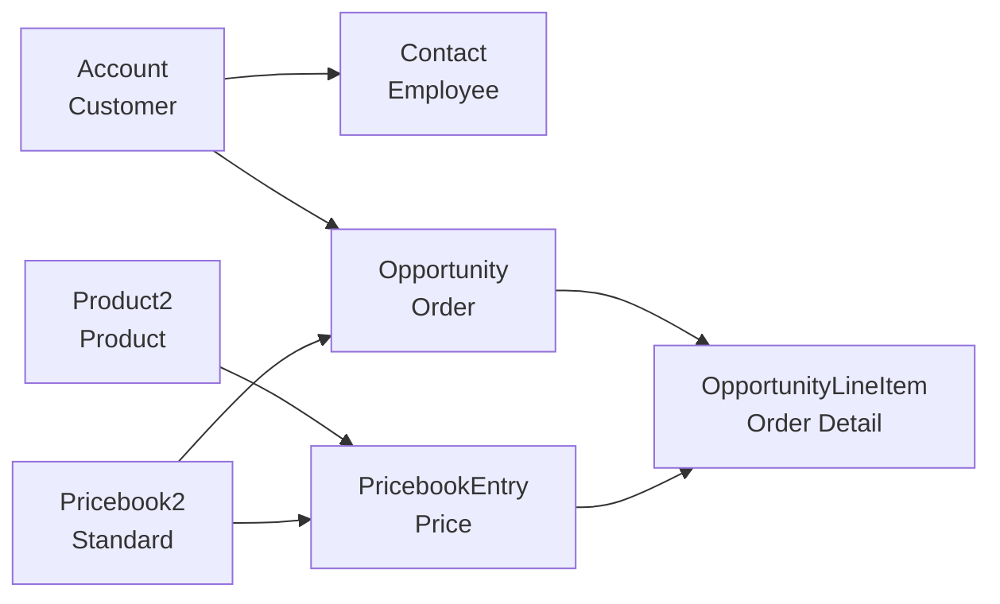

# Salesforce CRM Setup

## Overview

This guide covers setting up a Salesforce Developer Edition account and configuring it for the Classic Models demo. The `cmcli` tool uses **SOAP API authentication** (simple username/password/token) and handles all data seeding and custom field setup automatically.

## Step 1: Create a Salesforce Developer Edition Account

1. Go to [Salesforce Developer Signup](https://developer.salesforce.com/signup)
2. Fill in the registration form:
   - **Email**: Your email address
   - **First Name / Last Name**: Your name
   - **Role**: Developer
   - **Company**: Classic Models Demo
   - **Country**: Your country
   - **Postal Code**: Your postal code
3. Verify your email and set your password
4. Complete the Trailhead profile setup (optional)

> **Note**: Developer Edition is completely free and includes full API access with 15,000 API calls per 24 hours.

## Step 2: Enable SOAP API (CRITICAL)

**IMPORTANT**: Newer Salesforce orgs have SOAP API disabled by default. You MUST enable it:

1. Log in to your Salesforce Developer Edition
2. Go to **Setup** (gear icon) → **User Interface** → **User Interface**
3. Find the setting **"Enable SOAP API login"** or similar
4. Make sure it's **enabled/checked**
5. Click **"Save"**

> **⚠️ Critical**: Without SOAP API enabled, authentication will fail with "SOAP API login() is disabled" error.

## Step 3: Disable IP Restrictions (Recommended)

To avoid IP-related authentication issues:

1. Go to **Setup** → **Security** → **Session Settings**
2. Find **"Lock sessions to the IP address from which they originated"**
3. **Uncheck** this option
4. Click **"Save"**

## Step 4: Get Your Security Token

You need a security token to authenticate:

1. Go to **Setup** → **My Personal Information** → **Reset My Security Token**
2. Click **"Reset Security Token"**
3. Check your email for the new token (25 characters)
4. Save this token - you'll need it for the `.env` file

## Step 5: Get Your Instance URL

Your instance URL is shown in the browser address bar:
- Format: `https://[your-domain].develop.my.salesforce.com`
- Example: `https://orgfarm-e2e6e7008d-dev-ed.develop.my.salesforce.com`

## Step 6: Configure the CLI

Add credentials to `.env` in the project root:

```bash
# Salesforce SOAP API Credentials
SALESFORCE_USERNAME=your.email@example.com
SALESFORCE_PASSWORD=YourPassword123
SALESFORCE_SECURITY_TOKEN=AbCdEfGhIjKlMnOpQrSt
SALESFORCE_INSTANCE_URL=https://your-domain.develop.my.salesforce.com
SALESFORCE_API_VERSION=v59.0
```

**Important Notes:**
- Username is your Salesforce login email
- Password is ONLY your password (don't append the token here)
- Security token is separate (25 characters from email)
- Instance URL should NOT have a trailing slash
- No OAuth Client ID/Secret needed!

## Step 7: Check Required Custom Fields

Run the setup command to see what fields need to be created:

```bash
cmcli salesforce setup-fields
```

This will list all custom fields that need to be created manually in Salesforce.

## Step 8: Create Custom Fields Manually

You need to create custom fields on three standard objects: **Account**, **Contact**, and **Opportunity**.

### Account Custom Fields

1. Go to **Setup** → **Object Manager** → **Account**
2. Click **Fields & Relationships** → **New**
3. Create these fields:

**Field 1: ERP Customer Number** (CRITICAL - External ID)
- Data Type: **Text**
- Field Label: `ERP Customer Number`
- Length: `50`
- Field Name: `ERP_Customer_Number` (auto-filled)
- ✅ Check **External ID**
- ✅ Check **Unique**
- ✅ Check **Case insensitive**
- Description: `Customer number from Classic Models ERP system. Used for data synchronization.`
- Click **Next** → **Next** → **Save**

**Field 2: Credit Limit**
- Data Type: **Currency**
- Field Label: `Credit Limit`
- Length: `18` (default)
- Decimal Places: `2`
- Field Name: `Credit_Limit` (auto-filled)
- Description: `Customer credit limit from ERP system.`
- Click **Next** → **Next** → **Save**

**Field 3: Sales Rep Employee Number**
- Data Type: **Text**
- Field Label: `Sales Rep Employee Number`
- Length: `50`
- Field Name: `Sales_Rep_Employee_Number` (auto-filled)
- Description: `Employee number of assigned sales representative.`
- Click **Next** → **Next** → **Save**

### Contact Custom Fields

1. Go to **Setup** → **Object Manager** → **Contact**
2. Click **Fields & Relationships** → **New**
3. Create these fields:

**Field 1: ERP Employee Number** (CRITICAL - External ID)
- Data Type: **Text**
- Field Label: `ERP Employee Number`
- Length: `50`
- Field Name: `ERP_Employee_Number` (auto-filled)
- ✅ Check **External ID**
- ✅ Check **Unique**
- ✅ Check **Case insensitive**
- Description: `Employee number from Classic Models ERP system. Used for data synchronization.`
- Click **Next** → **Next** → **Save**

**Field 2: Office Code**
- Data Type: **Text**
- Field Label: `Office Code`
- Length: `10`
- Field Name: `Office_Code` (auto-filled)
- Description: `Office location code from ERP system.`
- Click **Next** → **Next** → **Save**

**Field 3: Reports To Employee Number**
- Data Type: **Text**
- Field Label: `Reports To Employee Number`
- Length: `50`
- Field Name: `Reports_To_Employee_Number` (auto-filled)
- Description: `Employee number of manager/supervisor.`
- Click **Next** → **Next** → **Save**

### Opportunity Custom Fields

1. Go to **Setup** → **Object Manager** → **Opportunity**
2. Click **Fields & Relationships** → **New**
3. Create these fields:

**Field 1: ERP Order Number** (CRITICAL - External ID)
- Data Type: **Text**
- Field Label: `ERP Order Number`
- Length: `50`
- Field Name: `ERP_Order_Number` (auto-filled)
- ✅ Check **External ID**
- ✅ Check **Unique**
- ✅ Check **Case insensitive**
- Description: `Order number from Classic Models ERP system. Used for data synchronization.`
- Click **Next** → **Next** → **Save**

**Field 2: ERP Customer Number**
- Data Type: **Text**
- Field Label: `ERP Customer Number`
- Length: `50`
- Field Name: `ERP_Customer_Number` (auto-filled)
- Description: `Customer number reference from ERP system.`
- Click **Next** → **Next** → **Save**

**Field 3: Order Date**
- Data Type: **Date**
- Field Label: `Order Date`
- Field Name: `Order_Date` (auto-filled)
- Description: `Original order date from ERP system.`
- Click **Next** → **Next** → **Save**

**Field 4: Required Date**
- Data Type: **Date**
- Field Label: `Required Date`
- Field Name: `Required_Date` (auto-filled)
- Description: `Customer requested delivery date.`
- Click **Next** → **Next** → **Save**

**Field 5: Shipped Date**
- Data Type: **Date**
- Field Label: `Shipped Date`
- Field Name: `Shipped_Date` (auto-filled)
- Description: `Actual shipment date.`
- Click **Next** → **Next** → **Save**

**Field 6: Order Status**
- Data Type: **Picklist**
- Field Label: `Order Status`
- Field Name: `Order_Status` (auto-filled)
- Values (one per line):
  ```
  Shipped
  Resolved
  Cancelled
  On Hold
  Disputed
  In Process
  ```
- Default Value: `In Process`
- Description: `Order status from ERP system.`
- Click **Next** → **Next** → **Save**

**Field 7: Payment Status**
- Data Type: **Picklist**
- Field Label: `Payment Status`
- Field Name: `Payment_Status` (auto-filled)
- Values (one per line):
  ```
  Pending
  Paid
  Partial
  Overdue
  ```
- Default Value: `Pending`
- Description: `Payment status derived from payment records.`
- Click **Next** → **Next** → **Save**

**Field 8: Order Comments**
- Data Type: **Text Area (Long)**
- Field Label: `Order Comments`
- Length: `32768`
- Visible Lines: `3`
- Field Name: `Order_Comments` (auto-filled)
- Description: `Comments and notes from the order.`
- Click **Next** → **Next** → **Save**

### Product2 Custom Fields

1. Go to **Setup** → **Object Manager** → **Product2**
2. Click **Fields & Relationships** → **New**
3. Create these fields:

**Field 1: ERP Product Code** (CRITICAL - External ID)
- Data Type: **Text**
- Field Label: `ERP Product Code`
- Length: `50`
- Field Name: `ERP_Product_Code` (auto-filled)
- ✅ Check **External ID**
- ✅ Check **Unique**
- ✅ Check **Case insensitive**
- Description: `Product code from Classic Models ERP system. Used for data synchronization.`
- Click **Next** → **Next** → **Save**

**Field 2: Product Scale**
- Data Type: **Text**
- Field Label: `Product Scale`
- Length: `50`
- Field Name: `Product_Scale` (auto-filled)
- Description: `Product scale/size from ERP system.`
- Click **Next** → **Next** → **Save**

**Field 3: Product Vendor**
- Data Type: **Text**
- Field Label: `Product Vendor`
- Length: `100`
- Field Name: `Product_Vendor` (auto-filled)
- Description: `Product vendor/manufacturer.`
- Click **Next** → **Next** → **Save**

**Field 4: MSRP**
- Data Type: **Currency**
- Field Label: `MSRP`
- Length: `18` (default)
- Decimal Places: `2`
- Field Name: `MSRP` (auto-filled)
- Description: `Manufacturer's suggested retail price.`
- Click **Next** → **Next** → **Save**

**Field 5: Buy Price**
- Data Type: **Currency**
- Field Label: `Buy Price`
- Length: `18` (default)
- Decimal Places: `2`
- Field Name: `Buy_Price` (auto-filled)
- Description: `Wholesale/purchase price from vendor.`
- Click **Next** → **Next** → **Save**

## Step 9: Verify Setup and Seed Data

```bash
# Verify access and that fields were created
cmcli salesforce verify

# Seed all demo data
cmcli salesforce seed
```

## CLI Commands

| Command | Description |
|---------|-------------|
| `cmcli salesforce verify` | Verify API credentials and check object permissions |
| `cmcli salesforce setup-fields` | Create custom ERP fields on standard objects |
| `cmcli salesforce seed` | Seed all accounts, contacts, and opportunities |
| `cmcli salesforce seed --accounts-only` | Seed only accounts |
| `cmcli salesforce seed --contacts-only` | Seed only contacts (requires accounts) |
| `cmcli salesforce seed --opportunities-only` | Seed only opportunities (requires accounts) |
| `cmcli salesforce seed --products-only` | Seed only products and pricebook entries |

## Data Seeded

The `cmcli salesforce seed` command seeds the full Classic Models dataset:

| Salesforce Object | Source | Count |
|-------------------|--------|-------|
| Accounts | Classic Models customers | 122 |
| Contacts | Classic Models employees | 23 |
| Opportunities | Classic Models orders | 326 |
| Products (Product2) | Classic Models products | 110 |
| PricebookEntry | Product prices | 110 |
| OpportunityLineItem | Order line items | 2,996 |

Seeding is **idempotent** — re-running updates existing records based on ERP IDs.

## Data Mappings

### Accounts ← Customers

| Salesforce Field | Classic Models Field | Notes |
|------------------|---------------------|-------|
| `Name` | `customerName` | Standard field |
| `BillingStreet` | `addressLine1` + `addressLine2` | Standard field |
| `BillingCity` | `city` | Standard field |
| `BillingState` | `state` | Standard field |
| `BillingPostalCode` | `postalCode` | Standard field |
| `BillingCountry` | `country` | Standard field |
| `Phone` | `phone` | Standard field |
| `Website` | Generated from name | Standard field |
| `ERP_Customer_Number__c` | `customerNumber` | Custom field (External ID) |
| `Credit_Limit__c` | `creditLimit` | Custom field |
| `Sales_Rep_Employee_Number__c` | `salesRepEmployeeNumber` | Custom field |

### Contacts ← Employees

| Salesforce Field | Classic Models Field | Notes |
|------------------|---------------------|-------|
| `FirstName` | `firstName` | Standard field |
| `LastName` | `lastName` | Standard field |
| `Email` | `email` | Standard field |
| `Phone` | `extension` | Standard field (formatted) |
| `Title` | `jobTitle` | Standard field |
| `Department` | Derived from `jobTitle` | Standard field |
| `AccountId` | Linked via `officeCode` | Standard field (lookup) |
| `ERP_Employee_Number__c` | `employeeNumber` | Custom field (External ID) |
| `Office_Code__c` | `officeCode` | Custom field |
| `Reports_To_Employee_Number__c` | `reportsTo` | Custom field |

### Opportunities ← Orders

| Salesforce Field | Classic Models Field | Notes |
|------------------|---------------------|-------|
| `Name` | Generated | `Order {N} - {customerName}` |
| `Amount` | Sum of order details | `quantityOrdered × priceEach` |
| `StageName` | Mapped from `status` | See table below |
| `CloseDate` | `shippedDate` or `orderDate` | Standard field |
| `AccountId` | `customerNumber` | Standard field (lookup) |
| `Probability` | Derived from stage | Standard field |
| `Type` | — | "New Business" |
| `ERP_Order_Number__c` | `orderNumber` | Custom field (External ID) |
| `ERP_Customer_Number__c` | `customerNumber` | Custom field |
| `Order_Date__c` | `orderDate` | Custom field |
| `Required_Date__c` | `requiredDate` | Custom field |
| `Shipped_Date__c` | `shippedDate` | Custom field |
| `Order_Status__c` | `status` | Custom field |
| `Payment_Status__c` | Derived from payments | Custom field |
| `Order_Comments__c` | `comments` | Custom field |

**Order status → Opportunity stage mapping**:

| Classic Models Status | Salesforce Stage | Probability |
|----------------------|------------------|-------------|
| Shipped | Closed Won | 100% |
| Resolved | Closed Won | 100% |
| Cancelled | Closed Lost | 0% |
| On Hold | Negotiation/Review | 60% |
| Disputed | Negotiation/Review | 60% |
| In Process | Proposal/Price Quote | 75% |

## Custom Fields Created

### Account Custom Fields
- `ERP_Customer_Number__c` (Text, External ID, Unique) — Classic Models customer number
- `Credit_Limit__c` (Currency) — Customer credit limit from ERP
- `Sales_Rep_Employee_Number__c` (Text) — Assigned sales rep employee number

### Contact Custom Fields
- `ERP_Employee_Number__c` (Text, External ID, Unique) — Classic Models employee number
- `Office_Code__c` (Text) — Office location code
- `Reports_To_Employee_Number__c` (Text) — Manager's employee number

### Opportunity Custom Fields
- `ERP_Order_Number__c` (Text, External ID, Unique) — Classic Models order number
- `ERP_Customer_Number__c` (Text) — Customer reference
- `Order_Date__c` (Date) — Original order date
- `Required_Date__c` (Date) — Customer required date
- `Shipped_Date__c` (Date) — Actual ship date
- `Order_Status__c` (Picklist) — Order status from ERP
- `Payment_Status__c` (Picklist) — `Pending` / `Paid` / `Partial` / `Overdue`
- `Order_Comments__c` (Long Text Area) — Order comments

### Product2 Custom Fields
- `ERP_Product_Code__c` (Text, External ID, Unique) — Classic Models product code
- `Product_Scale__c` (Text) — Product scale/size
- `Product_Vendor__c` (Text) — Product vendor/manufacturer
- `MSRP__c` (Currency) — Manufacturer's suggested retail price
- `Buy_Price__c` (Currency) — Wholesale/purchase price

## Salesforce Object Relationships



- **Account → Contact**: One-to-Many (via `AccountId` lookup)
- **Account → Opportunity**: One-to-Many (via `AccountId` lookup)
- **Opportunity → OpportunityLineItem**: One-to-Many (via `OpportunityId` lookup)
- **Product2 → PricebookEntry**: One-to-Many (via `Product2Id` lookup)
- **PricebookEntry → OpportunityLineItem**: One-to-Many (via `PricebookEntryId` lookup)
- **Pricebook2 → Opportunity**: One-to-Many (via `Pricebook2Id` lookup)

## webMethods Connector Configuration

| Parameter | Value |
|-----------|-------|
| Authentication Type | SOAP API / Username-Password |
| Username | Your Salesforce username |
| Password | Your password |
| Security Token | Your security token (separate field) |
| Instance URL | Your Salesforce instance URL |
| API Version | `v59.0` (or latest) |

## Rate Limits (Developer Edition)

- **API Calls**: 15,000 per 24 hours
- **Bulk API**: 5,000 records per batch
- **Data Storage**: 5 MB
- **File Storage**: 20 MB

The CLI will display an informative error if the Salesforce rate limit is exceeded.

## Salesforce API Versions

The CLI uses Salesforce REST API v59.0 (Winter '24) or later. Key features:
- Composite API for batch operations
- External ID upserts for idempotency
- SOQL queries for finding existing records

## Additional Resources

- [Salesforce Developer Documentation](https://developer.salesforce.com/docs)
- [REST API Developer Guide](https://developer.salesforce.com/docs/atlas.en-us.api_rest.meta/api_rest/)
- [Connected Apps Documentation](https://help.salesforce.com/s/articleView?id=sf.connected_app_overview.htm)
- [OAuth 2.0 Flows](https://help.salesforce.com/s/articleView?id=sf.remoteaccess_oauth_flows.htm)

## Troubleshooting

### "SOAP API login() is disabled" Error

This is the most common error with newer Salesforce orgs:

**Solution:**
1. Go to **Setup** → **User Interface** → **User Interface**
2. Enable **"SOAP API login"** or similar setting
3. Save and try again

### Authentication Failure

If authentication fails, check these in order:

#### 1. Verify Credentials in .env

```bash
# Username should be your full Salesforce login email
SALESFORCE_USERNAME=your.email@example.com

# Password is ONLY your password (don't append token here)
SALESFORCE_PASSWORD=YourPassword123

# Security token is separate (25 characters from email)
SALESFORCE_SECURITY_TOKEN=AbCdEfGhIjKlMnOpQrSt

# Instance URL should NOT have trailing slash
SALESFORCE_INSTANCE_URL=https://your-domain.develop.my.salesforce.com
```

**Common mistakes:**
- ❌ Adding security token to password field (keep them separate!)
- ❌ Using wrong username (must be exact login email)
- ❌ Trailing slash in instance URL
- ❌ Old/expired security token

#### 2. Get a Fresh Security Token

1. Go to **Setup** → **My Personal Information** → **Reset My Security Token**
2. Click **"Reset Security Token"**
3. Check your email immediately
4. Copy the new token to your `.env` file

#### 3. Check IP Restrictions

1. Go to **Setup** → **Security** → **Session Settings**
2. Uncheck **"Lock sessions to the IP address from which they originated"**
3. Save

#### 4. Verify API Access

1. Go to **Setup** → **Users** → **Users**
2. Click on your user
3. Make sure **"API Enabled"** is checked
4. Check your profile has API permissions

#### 5. Test with Verbose Logging

```bash
cmcli --verbose salesforce verify
```

This will show detailed authentication information.

### "Username-Password Flow Disabled" in Login History

This means OAuth Username-Password flow is disabled (not SOAP API). This is expected - the CLI uses SOAP API, not OAuth. As long as SOAP API is enabled (Step 2), this message can be ignored.

### "Insufficient Access" Error
- Ensure your user has "API Enabled" permission
- Check object-level permissions (CRUD) for Account, Contact, Opportunity
- Verify field-level security for custom fields

### Rate Limit Exceeded
- Developer Edition has 15,000 API calls per 24 hours
- Use `--accounts-only`, `--contacts-only`, `--opportunities-only`, or `--products-only` flags to seed incrementally
- Wait 24 hours for the limit to reset
- Check actual usage with `cmcli salesforce verify`

### Custom Fields Not Created
- Run `cmcli salesforce setup-fields` before seeding
- Check that you have "Customize Application" permission
- Verify field names don't conflict with existing fields